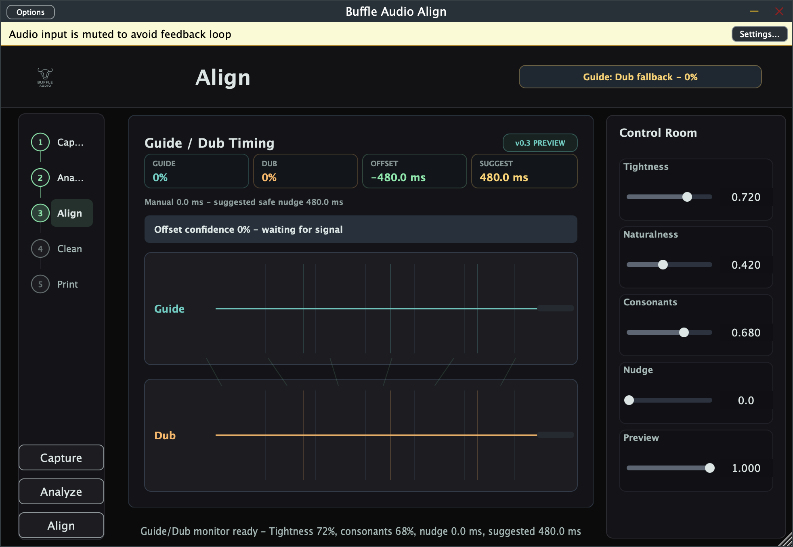
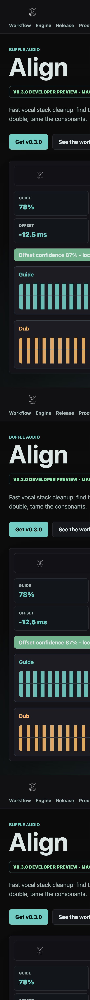
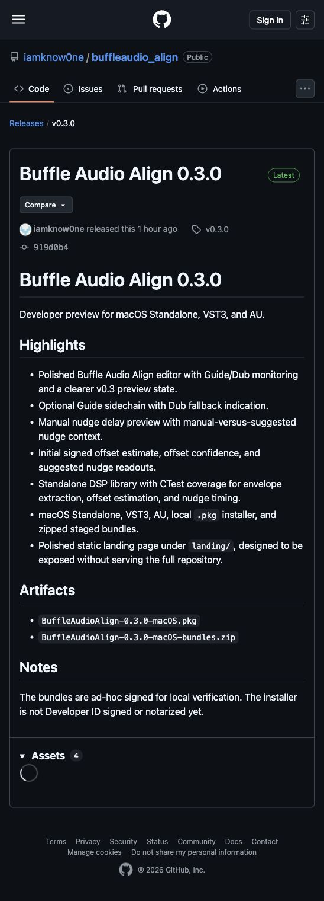

# Buffle Audio Align

> Fast vocal stack cleanup: find the timing offset, nudge the double, tame the consonants.

Buffle Audio Align is a JUCE audio plugin for vocal-stack alignment and articulation cleanup. Put it on a Dub or backing-vocal track, feed or monitor a Guide vocal, estimate the timing relationship, then tighten the Dub while preserving the small performance details that make stacked vocals feel alive.

Current release: `v0.3.0` developer preview for macOS Standalone, VST3, and AU.

## Links

- Landing page: https://buffleaudio-align.pages.dev/
- Latest release: https://github.com/iamknow0ne/buffleaudio_align/releases/tag/v0.3.0
- All releases: https://github.com/iamknow0ne/buffleaudio_align/releases
- Support development: https://buymeacoffee.com/hostin.tech
- Build notes: [docs/build.md](docs/build.md)
- Deployment notes: [docs/deployment.md](docs/deployment.md)
- Release inventory: [docs/releases.md](docs/releases.md)
- Healthcheck: [docs/healthcheck-2026-07-06.md](docs/healthcheck-2026-07-06.md)
- Roadmap: [ROADMAP.md](ROADMAP.md)

## Screenshots

Latest v0.3.0 captures from the live Pages deployment and GitHub release:







## What Works Now

- Branded Buffle Audio editor with the shared logo, dark teal visual identity, and in-plugin About panel.
- Persistent JUCE parameters through `AudioProcessorValueTreeState`.
- Session state save/restore.
- Optional `Guide` sidechain input bus, with the main input treated as `Dub`.
- Live Guide/Dub monitoring, signed offset estimate, offset confidence, and delay-safe suggested nudge.
- Realtime-safe manual nudge delay through a testable DSP module.
- Standalone DSP library with unit tests for envelope extraction, global offset estimation, and manual nudge timing.
- CMake build for Standalone, VST3, and AU.
- Local macOS `.pkg` installer generation.
- Static landing page in `landing/`, deployed to Cloudflare Pages and safe to expose without serving the full repository.

## Product Shape

The v0.3.0 direction is intentionally narrow:

1. Monitor or capture Guide and Dub.
2. Extract energy/onset envelopes.
3. Estimate a global timing offset.
4. Preview or apply a manual/automatic nudge.
5. Add a lightweight consonant cleanup pass.
6. Defer full DTW, time-stretch rendering, ARA, ML phoneme detection, and MIDI groove mode until the capture/analyze/preview loop is trustworthy.

## Build

The canonical build path is CMake. It currently uses the local JUCE checkout at:

```text
/Users/hostin/vibecoding/waveform-visualizer/JUCE
```

Override it with `JUCE_PATH=/path/to/JUCE`.

```bash
cmake -S . -B build/cmake-debug \
  -DJUCE_PATH=/Users/hostin/vibecoding/waveform-visualizer/JUCE \
  -DCMAKE_BUILD_TYPE=Debug \
  -DBUFFLE_BUILD_TESTS=ON

cmake --build build/cmake-debug --config Debug --parallel
ctest --test-dir build/cmake-debug --output-on-failure
```

## Package

```bash
scripts/build_and_package_macos.sh
```

Outputs:

- `dist/stage/Buffle Audio Align.app`
- `dist/stage/Buffle Audio Align.vst3`
- `dist/stage/Buffle Audio Align.component`
- `dist/BuffleAudioAlign-0.3.0-macOS.pkg`

The staged bundles are ad-hoc signed for local verification. The package is not Developer ID Installer signed or notarized yet.

## Landing Page

Cloudflare Pages production URL:

```text
https://buffleaudio-align.pages.dev/
```

Serve only the landing page folder locally:

```bash
scripts/serve_landing.sh
```

Then open:

```text
http://127.0.0.1:8088
```

If that port is already busy:

```bash
PORT=8099 scripts/serve_landing.sh
```

Expose only the landing folder through a quick Cloudflare Tunnel:

```bash
scripts/expose_landing_cloudflared.sh
```

Deploy the landing folder to Cloudflare Pages:

```bash
npx wrangler@latest pages deploy landing --project-name=buffleaudio-align --branch=main
```

## GitHub Releases

Both public preview releases are published on GitHub:

- `v0.3.0`: installer plus macOS bundle archive.
- `v0.2.0`: installer plus macOS bundle archive.

To publish a future release after building:

```bash
GITHUB_REPO=iamknow0ne/buffleaudio_align scripts/publish_github_release.sh
```

## Source Layout

```text
BufflePlug-Analyzer/Source/
  DSP/
    EnvelopeFeatureExtractor.*
    ManualNudgeDelay.*
    TimingOffsetEstimator.*
  PluginProcessor.*
  PluginEditor.*

tests/
  DSPCoreTests.cpp

landing/
  index.html
  styles.css
  assets/

scripts/
  build_and_package_macos.sh
  expose_landing_cloudflared.sh
  publish_github_release.sh
  serve_landing.sh
```

## Known Gaps

- Developer ID signing and notarization are still needed before broader distribution.
- JUCE should be pinned or vendored for fully reproducible builds.
- The legacy generated Xcode project should be regenerated if it becomes part of the supported build path.
- The current alignment path is nudge/analysis-first; full DTW/warping remains a future milestone.
