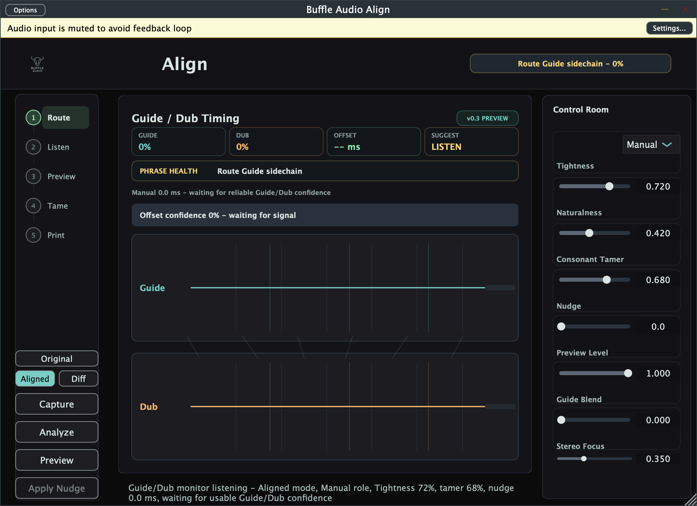

# Buffle Audio Align

> Fast vocal stack cleanup: find the timing offset, nudge the double, tame the consonants.

Buffle Audio Align is a JUCE audio plugin for vocal-stack alignment and articulation cleanup. Put it on a Dub or backing-vocal track, feed or monitor a Guide vocal, estimate the timing relationship, then tighten the Dub while preserving the small performance details that make stacked vocals feel alive.

Current release: `v0.3.0` developer preview for macOS Standalone, VST3, and AU.

## Links

- Landing page: https://buffleaudio-align.pages.dev/
- Latest release: https://github.com/iamknow0ne/buffleaudio_align/releases/tag/v0.3.0
- All releases: https://github.com/iamknow0ne/buffleaudio_align/releases
- Support development: https://buymeacoffee.com/hostin.tech
- Build notes: [docs/build.md](docs/build.md)
- Deployment notes: [docs/deployment.md](docs/deployment.md)
- Release inventory: [docs/releases.md](docs/releases.md)
- Healthcheck: [docs/healthcheck-2026-07-07-copy-report.md](docs/healthcheck-2026-07-07-copy-report.md)
- Roadmap: [ROADMAP.md](ROADMAP.md)

## Screenshot

Current v0.3.0 Standalone app capture:



## Try It In 5 Minutes

1. Install or unzip the latest macOS preview from the GitHub release.
2. Open the Standalone app, or insert the VST3/AU on a Dub/double/backing-vocal track.
3. Route the Guide vocal into the sidechain when your DAW supports it.
4. Play the phrase and watch Guide/Dub confidence lock.
5. Read the signed offset and positive-delay-first suggested nudge.
6. Use manual `Nudge`, or the confidence-gated Apply Nudge workflow in the app UI.
7. Raise `Consonant Tamer` carefully to soften unmatched Dub attacks without crushing sustained vowels.
8. Switch `Original`, `Aligned`, and `Diff` to hear the dry Dub, processed preview, or changed material before trusting the move.
9. Try `Stack Role` presets when the layer is a tight double, natural choir, rap stack, or ADR-style dub.
10. Use `Copy Report` to place a clipboard handoff summary of phrase health, confidence, offset, suggested nudge, preview mode, role, and current controls.

Preview build note: v0.3.0 is useful for local testing, but it is not Developer ID notarized yet. Treat it as a developer preview, not a broad public installer.

## What Works Now

- Branded Buffle Audio editor with the shared logo, dark teal visual identity, and in-plugin About panel.
- Persistent JUCE parameters through `AudioProcessorValueTreeState`.
- Session state save/restore.
- Optional `Guide` sidechain input bus, with the main input treated as `Dub`.
- Live Guide/Dub monitoring, signed offset estimate, offset confidence, and positive-delay-first suggested nudge.
- Realtime-safe manual nudge delay through a testable DSP module.
- Experimental Consonant Tamer Lite DSP for reducing unmatched Dub consonant bursts while preserving Guide-matched attacks.
- Original / Aligned / Difference preview modes for A/B trust checks.
- Stack Role presets: `Double Tight`, `Choir Natural`, `Rap Stack`, and `ADR Loose` apply role-aware Tightness, Naturalness, Consonant Tamer, Guide Blend, and Stereo Focus settings. Naturalness and Consonant Tamer are the most audible pieces today; deeper Guide Blend and Stereo Focus DSP is still V1 work.
- Phrase-health UI strip for route/listen/locked/safe-nudge states.
- Clipboard `Copy Report` handoff summary for phrase health, confidence, offset, suggested nudge, preview mode, stack role, and current controls.
- Standalone DSP library with unit tests for envelope extraction, global offset estimation, manual nudge timing, preview-mode rendering, stack-role profiles, and consonant-tamer behavior.
- CMake build for Standalone, VST3, and AU.
- Local macOS `.pkg` installer generation.
- Static landing page in `landing/`, deployed to Cloudflare Pages and safe to expose without serving the full repository.

## Product Shape

Buffle Audio Align is positioned as a timing decision surface for vocal doubles, not a black-box warper. The v0.3.x lane focuses on:

1. Monitor or capture Guide and Dub.
2. Extract energy/onset envelopes.
3. Estimate a global timing offset.
4. Gate suggestions by confidence so weak signals do not produce fake certainty.
5. Preview or apply a confidence-gated positive-delay nudge.
6. Add vocal-stack-specific consonant cleanup through an experimental transient tamer.
7. A/B Original, Aligned, and Difference preview before trusting or printing the move in the host.
8. Apply role-aware stack presets for doubles, harmony stacks, rap layers, and ADR-style dubs.
9. Copy a clipboard alignment report for tester/session handoff.
10. Defer full DTW, time-stretch rendering, ARA, ML phoneme detection, and MIDI groove mode until the capture/analyze/preview loop is trustworthy.

## V1 Direction

The V1 wedge is transparent stack cleanup: **delay-safe nudge + trust meter + consonant control**.

Differentiating V1 feature candidates:

- Trust Meter Alignment: explain Guide/Dub level, offset, confidence, and source state.
- One-Click Safe Nudge: apply only confidence-gated suggested positive delay movement; bidirectional early/late compensation remains V1 work.
- Consonant Tamer Lite: reduce unmatched Dub consonant bursts without flattening sustained vowels.
- Removed Material Audition: use Difference preview to hear what cleanup changes, then evolve toward dedicated removed-material metering.
- Naturalness Guardrail: warn when timing correction risks sterile doubles.
- Guide Fallback Intelligence: make routing problems visible and actionable.
- Phrase Health Report: identify weak guide, quiet dub, ambiguity, or unsafe nudge.
- Stack Spread Governor: preserve controlled width across doubles/harmonies.
- Breath Preservation Mask: protect breaths and expressive attacks.
- Vowel-Only Warp Preview: future micro-warping that avoids consonant smearing.
- Harmony-Aware Tightness Presets: `Double Tight`, `Choir Natural`, `Rap Stack`, and `ADR Loose` roles tune tightness, naturalness, consonant amount, guide blend, and stereo focus.
- Exportable Alignment Report: clipboard handoff report is implemented; file export and richer correction amount metering remain V1 work.

See [ROADMAP.md](ROADMAP.md) for milestones, risks, and verification gates.

## Build

The canonical build path is CMake. It currently uses the local JUCE checkout at:

```text
/Users/hostin/vibecoding/waveform-visualizer/JUCE
```

Override it with `JUCE_PATH=/path/to/JUCE`.

```bash
cmake -S . -B build/cmake-debug \
  -DJUCE_PATH=/Users/hostin/vibecoding/waveform-visualizer/JUCE \
  -DCMAKE_BUILD_TYPE=Debug \
  -DBUFFLE_BUILD_TESTS=ON

cmake --build build/cmake-debug --config Debug --parallel
ctest --test-dir build/cmake-debug --output-on-failure
```

## Package

```bash
scripts/build_and_package_macos.sh
```

Outputs:

- `dist/stage/Buffle Audio Align.app`
- `dist/stage/Buffle Audio Align.vst3`
- `dist/stage/Buffle Audio Align.component`
- `dist/BuffleAudioAlign-0.3.0-macOS.pkg`

The staged bundles are ad-hoc signed for local verification. The package is not Developer ID Installer signed or notarized yet.

## Landing Page

Cloudflare Pages production URL:

```text
https://buffleaudio-align.pages.dev/
```

Serve only the landing page folder locally:

```bash
scripts/serve_landing.sh
```

Then open:

```text
http://127.0.0.1:8088
```

If that port is already busy:

```bash
PORT=8099 scripts/serve_landing.sh
```

Expose only the landing folder through a quick Cloudflare Tunnel:

```bash
scripts/expose_landing_cloudflared.sh
```

Deploy the landing folder to Cloudflare Pages:

```bash
npx wrangler@latest pages deploy landing --project-name=buffleaudio-align --branch=main
```

## GitHub Releases

Both public preview releases are published on GitHub:

- `v0.3.0`: installer plus macOS bundle archive.
- `v0.2.0`: installer plus macOS bundle archive.

To publish a future release after building:

```bash
GITHUB_REPO=iamknow0ne/buffleaudio_align scripts/publish_github_release.sh
```

## Source Layout

```text
BufflePlug-Analyzer/Source/
  DSP/
    ConsonantTamer.*
    AlignmentReport.*
    EnvelopeFeatureExtractor.*
    ManualNudgeDelay.*
    PreviewModeMixer.*
    StackRolePreset.*
    TimingOffsetEstimator.*
  PluginProcessor.*
  PluginEditor.*

tests/
  DSPCoreTests.cpp

landing/
  index.html
  styles.css
  assets/

scripts/
  build_and_package_macos.sh
  expose_landing_cloudflared.sh
  publish_github_release.sh
  serve_landing.sh
```

## Known Gaps

- Developer ID signing and notarization are still needed before broader distribution.
- JUCE should be pinned or vendored for fully reproducible builds.
- The legacy generated Xcode project should be regenerated if it becomes part of the supported build path.
- The current alignment path is nudge/analysis-first; full DTW/warping remains a future milestone.
